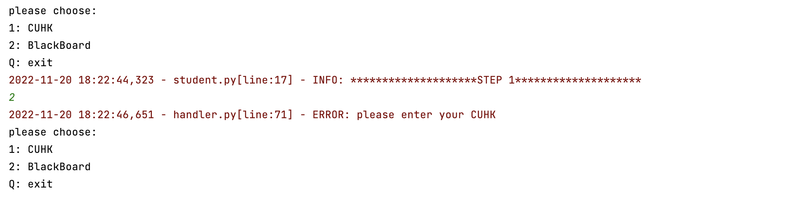
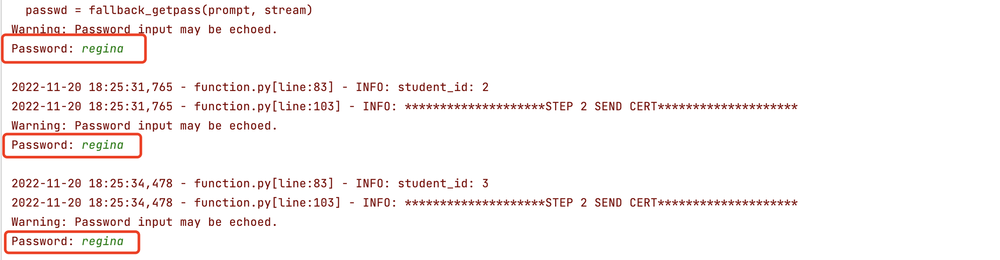
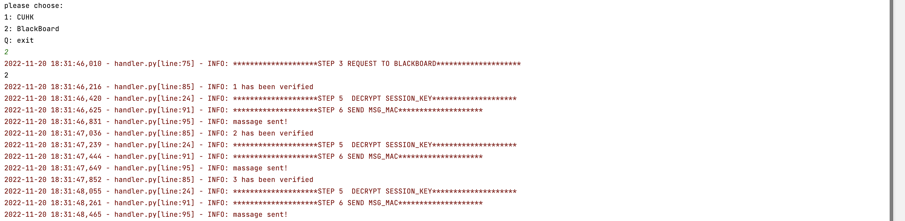

# HOW TO RUN

1. The three py files required by the file are stored in `IEMS5710/client/student.py` , `IEMS5710/server/cuhk.py` and `IEMS5710/server/blackboard.py`. When you have run the server side and client side, There is a check here to verify whether you have a certificate issued by CUHK. If not, you must first visit CUHK, and then visit BLACKBORARD.

2. Hence, you have to choose **1** to choose UCHK. When you log in CUHK server, please you enter the key, which is used to generate CA private key, defined `regina`.(It may seem a bit redundant to input, thanks to the teaching assistant)

3. I have put every label in the logging info, so it will provide a more clear process effect. Then blackboard server is available. You can go back to `student.py` to choose again.

   

   As you can see, step4-6 will automatically run, including cert_verification, generating MAC and encrypting message, as well as sending message. 

# PACKAGE REQUIREMENTS

> 1. **logging** : output the result and content of every step
> 2. **struct** : Convert Python data to a string according to the specified format,the string is a byte stream. Convert the byte stream to the data type specified by Python according to the specified format;
> 3. **socket** : Used to provide connection-oriented, reliable data transmission services
> 3. **select** : Notifies the process that executed select() which Socket or file is readable or writable. Mainly used in Socket communication
> 3. **getpass** : The module provides a platform-independent way to enter passwords on the command line
> 3. **cryptography** :  Encrypt and decrypt strings using cryptography Encryption code
> 3. **datetime** : usage time
