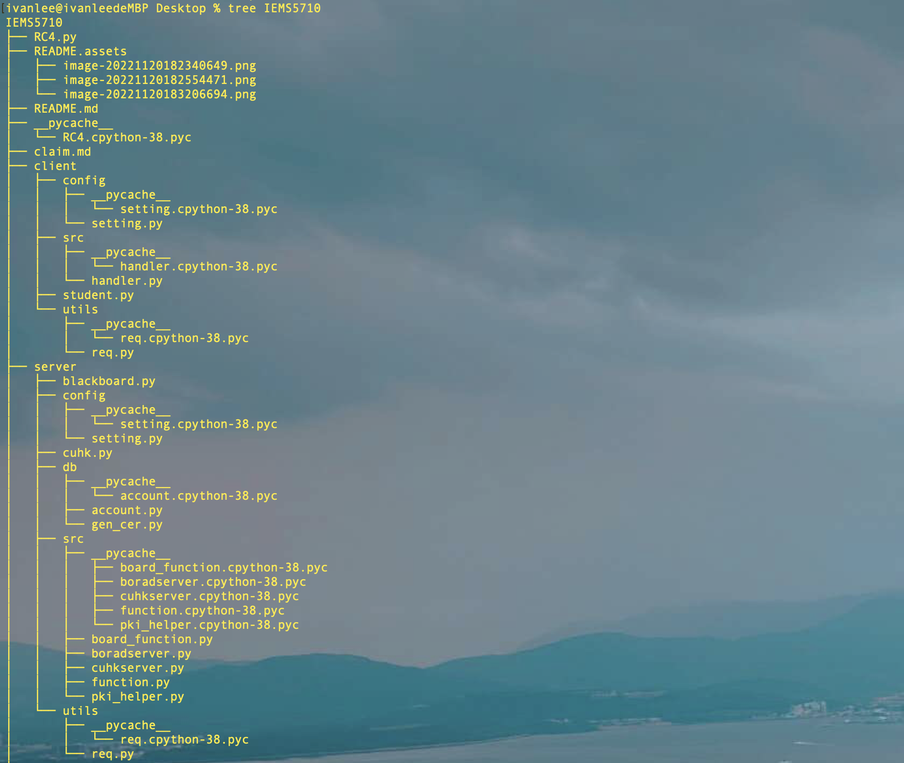

This is my GitHub account: [Regina's_IVANLEE](https://github.com/Ivan990717/IEMS5710)

# 1. code structure



As we can see in the picture, due to the huge amount of code, I first separated the server and client. Separately, I divided the codes in each side into different directories according to the functions, main files, and configuration information. The main students, CUHK, blackboard three files are in the most prominent position, and the amount of code in the file is very small.I use the student file as an example

```python
'''
designed by ivanlee
'''
import time

from client.src.handler import Handler
import logging
logging.basicConfig(level=logging.DEBUG,
                    format='%(asctime)s - %(filename)s[line:%(lineno)d] - %(levelname)s: %(message)s')  # logging.basicConfig
# function configures the output format and method of the log


if __name__ == "__main__":
    stu = []
    logging.info('*'*20 + "STEP 0" + '*'*20)
    time.sleep(0.2)
    for i in range(3):

        stu.append(input("please input the id: "))
    logging.info('*' * 20 + "STEP 1" + '*' * 20)
    handler = Handler()
    handler.run(stu)
```

# 2. socket

We use the socket framework as a whole to complete the communication process between the two parties, and at the very beginning, the function of the server socket can complete the concurrent operations of multiple clients.

```python
    def run_server(self,Verifyboard):
        logging.info('*' * 20 + "STEP 1" + '*' * 20)
        server_object = socket.socket(socket.AF_INET, socket.SOCK_STREAM)
        server_object.setsockopt(socket.SOL_SOCKET, socket.SO_REUSEADDR, 1)

        server_object.setblocking(True)
        server_object.bind((self.host, self.port))
        server_object.listen(5)
        self.socket_object_list.append(server_object)

        while True:
            r, w, e = select.select(self.socket_object_list, [], [], 0.05)
            for sock in r:
                # 新连接到来，执行 handler的 __init__ 方法
                if sock == server_object:
                    conn, addr = server_object.accept()
                    self.socket_object_list.append(conn)
                    # 实例化handler类，即：类(conn)
                    self.conn_handler_map[conn] = Verifyboard(conn)
                    logging.info('new connection is coming')
                    continue

                # 新数据到来，执行 handler的 __call__ 方法
                handler_object = self.conn_handler_map[sock]
                # print(handler_object)
                # 执行handler类对象的 execute 方法，如果返回False，则意味关闭服务端与客户端的连接

                result = handler_object.execute_()
                if not result:
                    self.socket_object_list.remove(sock)
                    del self.conn_handler_map[sock]
                sock.close()
```

